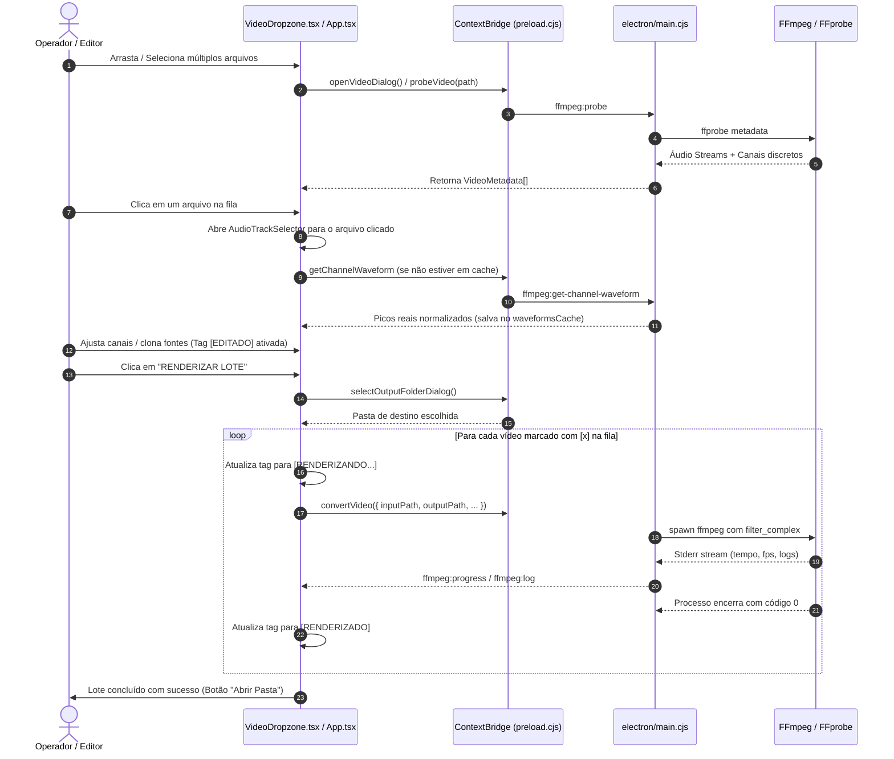

# 🗺️ Mapa Completo do Projeto — Flash Master Studio v1.0.2

Este documento detalha toda a arquitetura de software, estrutura de diretórios, comunicação entre processos (IPC), fluxo de processamento de áudio DSP e ciclo de vida do aplicativo **Flash Master**.

---

## 1. Visão Geral da Arquitetura

O sistema adota uma arquitetura desacoplada em duas camadas principais conectadas por um **ContextBridge seguro**:

```mermaid
graph TD
    subgraph "Main Process (Node.js / Electron)"
        A[electron/main.cjs] -->|Spawn / Stream| B[FFmpeg & FFprobe x64]
        A -->|Janela Nativa| C[BrowserWindow]
        A -->|Diálogos SO| D[dialog.showOpenDialog / showSaveDialog]
        A -->|Auto Update| E[electron-updater]
    end

    subgraph "ContextBridge (preload.cjs)"
        F[window.electronAPI]
    end

    subgraph "Renderer Process (React 19 + TypeScript)"
        G[src/main.tsx] --> H[src/App.tsx]
        H --> I[VideoDropzone.tsx]
        H --> J[AudioTrackSelector.tsx]
        H --> K[VideoPlayerPreview.tsx]
        H --> L[ConversionTerminal.tsx]
        H --> M[AudioSettingsModal.tsx]
    end

    A <-->|IPC Events (invoke / handle / send)| F
    F <-->|Bridge Global Seguro| H
```

---

## 2. Árvore de Diretórios e Detalhamento de Arquivos

```
FlashMaster/
├── electron/
│   ├── main.cjs               # Processo Principal (Ciclo de vida, IPC, FFmpeg spawn, Menus nativos, AutoUpdater)
│   └── preload.cjs            # ContextBridge seguro (expõe window.electronAPI sem vazar Node.js para o Renderer)
├── src/
│   ├── components/
│   │   ├── AudioLimiterVisualizer.tsx # Visualizador gráfico da curva de transferência e compressão do limiter
│   │   ├── AudioSettingsModal.tsx     # Janela modal para ajuste de ganho (+dB) e limiter (-dBFS) com persistência
│   │   ├── AudioTrackSelector.tsx     # Seletor e roteador de canais discretos de áudio (L, R, Audiodescrição)
│   │   ├── AudioVuMeter.tsx           # Medidores de modulação e nível de áudio estéreo/multicanal em tempo real
│   │   ├── ChannelWaveform.tsx        # Renderizador de barras de onda de áudio (Waveform Strip)
│   │   ├── CodeExplorer.tsx           # Visualizador didático dos arquivos-fonte do projeto
│   │   ├── ConversionTerminal.tsx     # Console de execução do FFmpeg, progresso em lote e logs ao vivo
│   │   ├── Navbar.tsx                 # Barra de navegação e controles superiores
│   │   ├── PackagingGuide.tsx         # Guia de empacotamento com electron-builder
│   │   ├── VideoDropzone.tsx          # Fila de arquivos, seleção múltipla, checkboxes de lote e tags de status
│   │   └── VideoPlayerPreview.tsx     # Monitor de vídeo com alternância A/B (Original vs Corrigido)
│   ├── data/
│   │   └── electronCodeFiles.ts       # Metadados e código dos arquivos incorporados para documentação interna
│   ├── utils/
│   │   └── zipExporter.ts             # Utilitário de exportação do projeto em formato ZIP
│   ├── App.tsx                        # Componente Raiz: Gerencia estado da fila, cache de waveforms e layout principal
│   ├── index.css                      # Estilos globais e tokens de cores do TailwindCSS
│   ├── main.tsx                       # Ponto de entrada do React 19 (ReactDOM.createRoot)
│   └── types.ts                       # Tipagem TypeScript centralizada (VideoMetadata, AudioChannelInfo, ElectronAPI, etc.)
├── index.html                         # Documento HTML principal da aplicação
├── package.json                       # Manifesto do projeto, dependências, scripts e configuração do electron-builder
├── tsconfig.json                      # Configurações do compilador TypeScript
├── vite.config.ts                     # Configuração do Vite (plugins React, TailwindCSS e portas)
├── README.md                          # Apresentação do projeto, recursos e guia rápido
├── MAPA_DO_PROJETO.md                 # Este documento de arquitetura e mapa detalhado
└── REQUISITOS_MINIMOS.md              # Requisitos de hardware e conformidade broadcast
```

---

## 3. Mapeamento de Comunicação IPC (ContextBridge)

A comunicação entre a interface (Renderer) e o sistema operacional (Main) é estritamente tipada e mediada por `window.electronAPI`:

| Canal IPC | Tipo | Origem $\rightarrow$ Destino | Descrição |
|---|---|---|---|
| `dialog:open-video` | `invoke` / `handle` | Renderer $\rightarrow$ Main | Abre o diálogo nativo do Windows com suporte a seleção múltipla (`multiSelections`) |
| `dialog:select-output` | `invoke` / `handle` | Renderer $\rightarrow$ Main | Abre o diálogo para salvar um arquivo MXF individual (`.mxf`) |
| `dialog:select-output-folder` | `invoke` / `handle` | Renderer $\rightarrow$ Main | Abre o diálogo para selecionar uma pasta de destino para renderizações em lote |
| `shell:open-folder` | `invoke` / `handle` | Renderer $\rightarrow$ Main | Abre o Explorer do Windows com o arquivo de saída selecionado no disco |
| `ffmpeg:probe` | `invoke` / `handle` | Renderer $\rightarrow$ Main | Executa o `ffprobe` e extrai metadados completos de vídeo e todos os canais de áudio |
| `ffmpeg:get-channel-waveform` | `invoke` / `handle` | Renderer $\rightarrow$ Main | Extrai picos reais de modulação de um canal específico em alta velocidade |
| `ffmpeg:convert` | `invoke` / `handle` | Renderer $\rightarrow$ Main | Dispara o `spawn(ffmpeg)` com a cadeia de filtros de áudio e vídeo MXF OP-1a |
| `ffmpeg:cancel` | `invoke` / `handle` | Renderer $\rightarrow$ Main | Encerra o processo ativo do FFmpeg imediatamente (`kill()`) |
| `ffmpeg:progress` | Event Stream | Main $\rightarrow$ Renderer | Emite dados em tempo real: `% concluído`, frames, fps, bitrate e tempo decorrido |
| `ffmpeg:log` | Event Stream | Main $\rightarrow$ Renderer | Transmite linhas brutas de saída do terminal do FFmpeg para o console |
| `menu:open-audio-settings` | Event Stream | Main $\rightarrow$ Renderer | Acionado via atalho `Ctrl + ,` ou menu `Window -> Configurações de Áudio` |
| `menu:toggle-logs` | Event Stream | Main $\rightarrow$ Renderer | Acionado via atalho `Ctrl + L` ou menu `Window -> Ver Logs` |

---

## 4. Pipeline de Áudio DSP & Cadeia de Filtros do FFmpeg

### Filtro Complexo Multicanal com Roteamento e Limiter
Quando múltiplos canais são configurados na interface (por exemplo, 4 canais discretos), o FFmpeg constrói dinamicamente a cadeia `-filter_complex`:

```
[0:a:0]pan=1c|c0=c0,volume=7.0dB,alimiter=limit=-12.0dB:attack=5:release=50:asc=0:level=false[out_ch_0];
[0:a:0]pan=1c|c0=c1,volume=7.0dB,alimiter=limit=-12.0dB:attack=5:release=50:asc=0:level=false[out_ch_1];
[0:a:1]pan=1c|c0=c0,volume=7.0dB,alimiter=limit=-12.0dB:attack=5:release=50:asc=0:level=false[out_ch_2];
[0:a:1]pan=1c|c0=c1,volume=7.0dB,alimiter=limit=-12.0dB:attack=5:release=50:asc=0:level=false[out_ch_3]
```

### Argumentos de Codificação Master MXF:
* **Mapeamento de Vídeo:** `-map 0:v:0`
* **Mapeamento de Áudio:** `-map [out_ch_0] -map [out_ch_1] -map [out_ch_2] -map [out_ch_3]`
* **Vídeo:** `-c:v mpeg2video -b:v 50M -pix_fmt yuv422p -g 12 -bf 2 -flags +ildct+ilme -top 1`
* **Áudio:** `-c:a pcm_s24le -ar 48000`
* **Container:** `-f mxf`

---

## 5. Ciclo de Vida da Fila e Renderização em Lote



---

## 6. Modelos de Dados Centrais (`src/types.ts`)

### `VideoMetadata`
```typescript
export interface VideoMetadata {
  filename: string;
  filepath?: string;
  filesize: number;
  format_name: string;
  format_long_name: string;
  duration: number;
  bit_rate: number;
  video_codec: string;
  width: number;
  height: number;
  fps: number;
  aspect_ratio: string;
  pixel_format: string;
  audio_streams: AudioStreamInfo[];
  audio_channels?: AudioChannelInfo[];
  video_stream_index: number;
  isChromiumCompatible: boolean;
  sampleUrl?: string;
  isBatchChecked?: boolean; // Checkbox para inclusão no lote
  isEdited?: boolean;       // Tag [EDITADO]
  renderStatus?: 'idle' | 'rendering' | 'completed' | 'error'; // Tags de status
}
```

### `AudioChannelInfo`
```typescript
export interface AudioChannelInfo {
  id: string;              // Identificador único: "${streamIndex}:${channelIndex}"
  streamIndex: number;     // Índice da trilha de áudio
  channelIndex: number;    // Índice do canal dentro da trilha (0 = L, 1 = R)
  channelNumber: number;   // Número ordinal global (Canal 1, 2, 3, 4...)
  label: string;           // Ex: "Canal 1: Esquerdo (L)"
  layoutName: string;      // Ex: "Esquerdo (L)"
  codec_name: string;      // Ex: "pcm_s24le", "aac"
  sample_rate: number;     // Ex: 48000
  selected: boolean;       // Se será exportado no MXF
  sourceChannelId?: string;// Roteamento/Clonagem (ex: puxar áudio de "0:0")
}
```

---

## 7. Configuração de Build e Empacotamento (`package.json`)

* **Artifact Name Padronizado:** `"Flash-Master-Setup-${version}.${ext}"` (evita que o GitHub substitua espaços por pontos e quebre o `latest.yml`).
* **Descompressão ASAR (`asarUnpack`):**
  * `ffmpeg-static` e `ffprobe-static` são extraídos para `app.asar.unpacked/` para execução nativa pelo Windows sem bloqueio de permissão.
* **NSIS Installer:** Permite ao usuário escolher a pasta de instalação, cria atalho na Área de Trabalho e registra instalador de 64 bits.
